# 📊 E-commerce Sales & Customer Insights

### Опис проєкту

Цей проєкт присвячений аналізу даних електронної комерції з метою дослідження клієнтської поведінки, оцінки ефективності знижок та виявлення ключових бізнес-інсайтів.

Основна мета — надати комерційному директору аналітичну основу для прийняття обґрунтованих управлінських рішень. У межах проєкту проаналізовано динаміку виручки та сезонність продажів, оцінено вплив знижок на середній чек і структуру покупок, визначено найбільш цінні клієнтські сегменти за доходом і поведінковими характеристиками, а також досліджено залежність між віком клієнта та сумою його витрат.

Проєкт складається з чотирьох основних частин:
 - SQL-аналіз бази даних в BigQuery
 - Створення інтерактивного дашборду в Tableau
 - Бізнес-аналіз клієнтських сегментів
 - Побудова лінійної регресії в Python

Інструменти:
- SQL (BigQuery)
- Tableau
- Python (pandas, sklearn, matplotlib, seaborn)
- GitHub

 
 1️⃣ SQL-аналіз бази даних в BigQuery 
 

База даних: thelook_ecommerce \
Джерело: Google BigQuery (public dataset)

Було виконано 5 аналітичних запитів:

1️⃣ Аналіз користувачів з Бразилії

Отримано список користувачів з країни Brasil, які зареєструвалися у 2023 році.
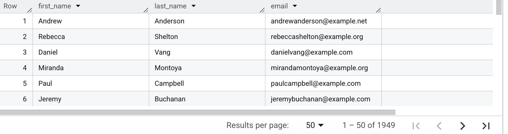

2️⃣ Топ-категорії товарів

Виявлено категорії з найбільшим асортиментом.
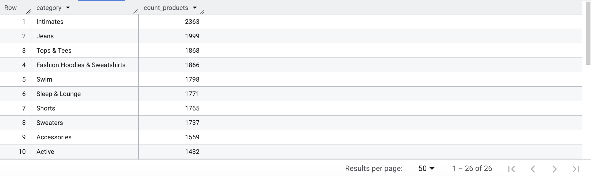

3️⃣ Аналіз відправлених замовлень

Отримано список клієнтів із замовленнями зі статусом Shipped.
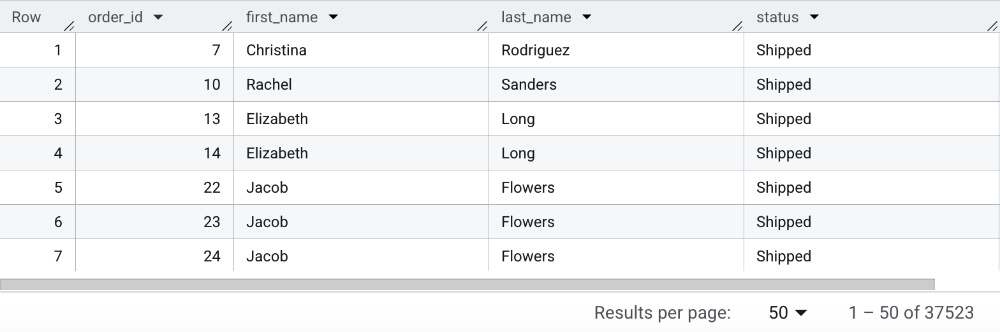

4️⃣ Найдорожчі замовлення

Знайдено 10 найдорожчих замовлень.

5️⃣ Географія клієнтів

Визначено країни, де кількість користувачів перевищує 500.
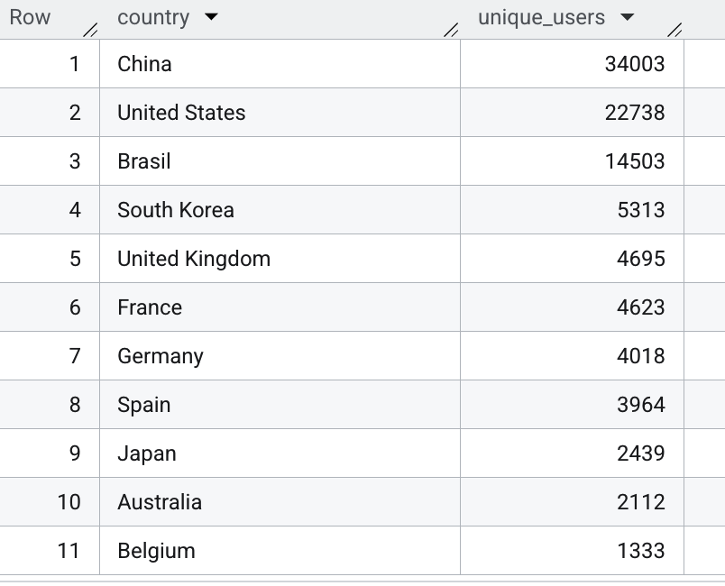

📎 Файл із SQL-запитами: BigQuery_SQL.md

2️⃣ Tableau — Візуалізація даних

Джерело даних: Ecommerce Dataset for Data Analysis (Kaggle)

Мета: Проаналізувати дані, виявити закономірності та представити результати у вигляді інтерактивного дашборду.

1️⃣ Динамика доходів

Загальна сума продажів за місяцями, починаючи з січня 2022 року по теперішній час.
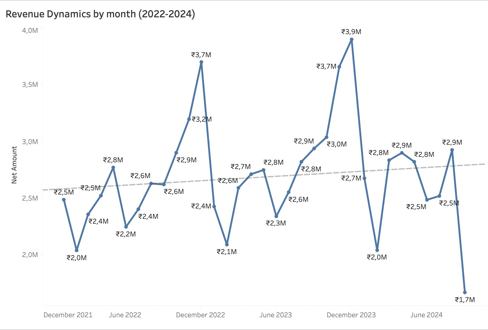

Основні спостереження:

1. Наявна сезонність продажів.\
Грудень 2022 — ~₹3,7M
Грудень 2023 — ~₹3,9M (найвищий показник за весь період)
Це свідчить про сильний вплив передсвяткового періоду на продажі.

2. Післяпікове падіння в січні.\
Після грудневого максимуму дохід різко знижується (приблизно до ~₹2,0–2,1M), що є типовою постсвятковою корекцією попиту.

3. Помірне зростання тренду.\
Лінія тренду демонструє поступове зростання загального рівня доходів протягом трьох років.
Це може свідчити про зростання клієнтської бази, підвищення середнього чека або масштабування маркетингових активностей.

4. Стабільний середній рівень протягом року.\
У більшості місяців виручка коливається в діапазоні ₹2,5–2,9M, що говорить про відносно стабільний попит поза сезонними піками.

🎯 Висновок:

Продажі мають чітко виражену сезонність із максимальними значеннями в кінці року. Загальний тренд є позитивним, що свідчить про поступове зростання бізнесу. Для підвищення ефективності компанії варто посилювати маркетингову активність у пікові періоди та працювати над стабілізацією продажів у першому кварталі року.

2️⃣ Аналіз ефективності знижок

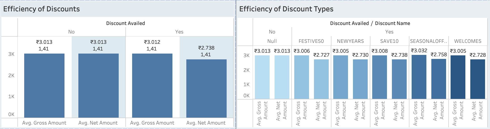

При покупках зі знижкою різниця між Gross і Net становить приблизно ₹274, що і є середнім ефектом знижки.

Основні спостереження:

1. Знижки не збільшують середній чек.\
Середній дохід - Gross Amount - майже однаковий у двох групах (~₹3,013 vs ~₹3,012). Це означає, що клієнти не купують більше товарів через знижку, а просто платять менше за приблизно той самий обсяг покупки.

2. Чистий дохід - Net Amount - значно нижчий при знижках.\
Середній чек Net Amount при застосуванні знижки на ~9% нижчий, що напряму впливає на маржинальність та прибутковість компанії.

3. Знижки — інструмент залучення, а не збільшення чека.\
З аналізу видно, що знижки не стимулюють збільшення середнього чека, але зменшують дохід з кожної транзакції.

Додатковий аналіз типів знижок:

Було також порівняно різні типи знижок (FESTIVE50, NEWYEARS, SAVE10,SEASONALOFFER21, WELCOME5). У всіх випадках Gross Amount залишається приблизно на рівні ₹3,000, тоді як Net Amount трохи знижується залежно від типу знижки.
Найбільше значення Net Amount спостерігається при сезонних знижках. Це підтверджує, що клієнтська поведінка майже не змінюється залежно від типу знижки — змінюється лише фінальний дохід компанії.

🎯 Висновок:

Аналіз показав, що знижки не підвищують середній чек, а лише зменшують чисту виручку з кожного замовлення. Тому їх доцільно використовувати як інструмент залучення нових клієнтів, стимулювання попиту в низький сезон чи очищення складу (розпродаж). Для бізнесу важливо контролювати їх використання, щоб не знижувати маржинальність без реального приросту обсягу продажів.

3️⃣ Портрет покупця по категоріям товарів

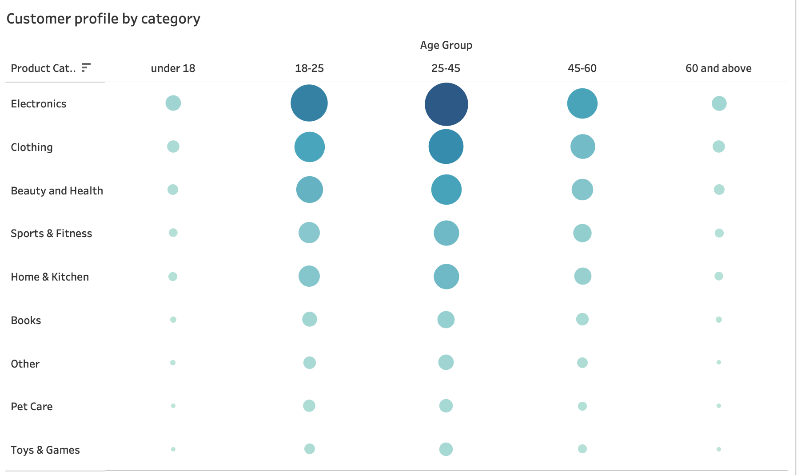

Основні спостереження:

1. Вікова група 25–45 — найактивніший сегмент.\
Найбільші обсяги витрат практично в усіх категоріях. Особливо домінує в категорії Electronics.
Також високі показники у Clothing та Beauty & Health. Можна зробити висновок, що це ключова платоспроможна аудиторія компанії.

2. Вікова група 18–25.\
Активно купує Electronics та Clothing та менш активна у категоріях Home & Kitchen та Books. З цього можемо зробити висновок, що молоді клієнти тяжіють до технологічних та модних товарів(брендів).

3. Вікова група 45–60.\
Помітний інтерес до Electronics, Clothing та Home & Kitchen, але загальний рівень витрат нижчий, ніж у групи 25–45.
Сегмент стабільний, але менш активний.

4. 60+ та under 18.\
Найнижчий рівень витрат. Покупки носять вибірковий характер, тому ці сегменти не є основними драйверами доходу.

Загальні закономірності:
 - Electronics — найпопулярніша категорія серед усіх вікових груп.
 - Основний обсяг виручки генерує група 25–45 років.
 - Попит зменшується зі зростанням віку після 45 років.
 - Молодша аудиторія більш орієнтована на моду та технології.

🎯 Висновок:

Аналіз показав, що найбільш прибутковим сегментом є клієнти віком 25–45 років, які демонструють найвищі витрати у більшості категорій. Категорія Electronics є лідером у всіх вікових групах, що вказує на її стратегічну важливість для компанії. Тому основний фокус маркетингового бюджету доцільно спрямовувати на сегмент 25–45 років, особливо в категорії Electronics. Для вікової групи 18–25 ефективними можуть бути digital-кампанії та промо на техніку.
Для 45+ можна розробляти більш персоналізовані пропозиції.

4️⃣ Популярність категорій товарів у різних містах

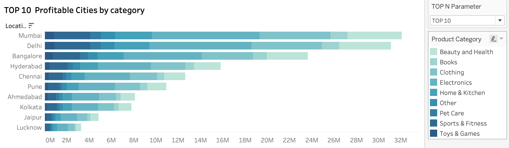

Основні спостереження:

1. Найбільш прибуткові міста - Mumbai, Delhi, Bangalore. Ці міста формують найбільший обсяг загальної виручки компанії.

2. Electronics — ключова категорія у всіх містах. У кожному з ТОП-10 міст категорія Electronics займає одну з найбільших часток у структурі доходу. Тому можна зробити висновок, що Electronics є стратегічно важливою категорією для компанії незалежно від географії.

3. У великих містах (Mumbai, Delhi, Bangalore) високі показники також демонструють категорії: Clothing, Home & Kitchen.

4. Менші міста — нижчий обсяг, але схожа структура попиту (Electronics залишається лідером).

5. Такі категорії як: Books, Pet Care, Toys & Games, Beauty & Health формують меншу частку в загальному доході, але стабільно присутні в усіх містах.

🎯 Висновок:

Аналіз показав, що найбільший дохід компанія отримує з мегаполісів — Mumbai, Delhi та Bangalore. Незалежно від міста, категорія Electronics є лідером продажів. Це означає, що компанія має сильний фокус на технологічному сегменті, а географічні відмінності більше впливають на масштаб доходу, ніж на структуру попиту. Тому маркетинговий бюджет доцільно концентрувати у містах-лідерах (Mumbai, Delhi, Bangalore). Категорія Electronics повинна залишатися фокусною для всіх регіонів, а для менших міст можна тестувати локальні промо-кампанії з фокусом на топ-категоріях.

### Tableau Dashboard: E-commerce Analytics: Sales & Customer Insights

У межах аналізу було досліджено динаміку продажів, ефективність знижок, поведінку клієнтів за віковими групами та географічну структуру прибутковості.

🎯 Висновок:

Вцілому аналіз показав, що бізнес має стабільну позитивну динаміку з вираженою сезонністю (листопад–грудень). Основний дохід генерується клієнтами 25–45 років у великих містах, а категорія Electronics є ключовим драйвером продажів незалежно від віку та регіону. Знижки не збільшують середній чек, тому їх варто використовувати як інструмент стимулювання попиту, а не як постійну стратегію зростання.

Основні рекомендації:

- Посилити маркетингові кампанії у листопаді-грудні.
- Фокусуватися на сегменті 25–45 років.
- Контролювати глибину знижок для збереження маржинальності.
- Розвивати другорядні категорії для збільшення доходу.

📎 Файл Tableau Dashboard "E-commerce Analytics: Sales & Customer Insights": E-commerce_Analytics.twbx
https://public.tableau.com/views/Final_Project_DTA/E-commerceAnalyticsSalesCustomerInsights?:language=en-US&:sid=&:redirect=auth&:display_count=n&:origin=viz_share_link

3️⃣ Бізнес-кейс: Аналіз клієнтських груп

Мета: порівняти дві групи клієнтів, Група А (чоловіки) та Група Б (жінки), додатково розділені за віковою категорією.

1️⃣ Яка група клієнтів приносить компанії більший загальний дохід?

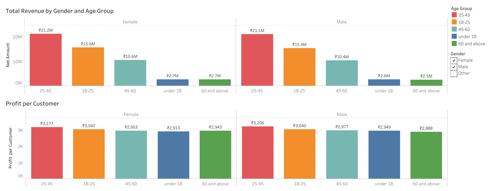

Основні спостереження:

- В обох групах найбільший дохід генерує сегмент 25–45 років.
- У всіх вікових категоріях показники жінок незначно вищі.
- Різниця між статями мінімальна, але стабільно на користь жінок.

Додатковий аналіз: Profit per Customer (Хто більш прибутковий у перерахунку на одного клієнта?)

- Найвищий прибуток на одного клієнта спостерігається у віковій групі 25–45 (в обох статей).
- У чоловіків у сегменті 25–45 показник трохи вищий (₹3,206 vs ₹3,177).
- У молодших та старших сегментах різниця незначна.

🎯 Висновок:

Аналіз показав, що жінки приносять трохи більший загальний дохід, але якщо дивитися на прибуток на одного клієнта, різниця мінімальна, тому гендер не є ключовим фактором. Основним драйвером виручки є вікова група 25–45 років незалежно від статі. Тому стратегічно доцільно фокусуватися саме на цьому сегменті, а не на гендерному розподілі.

2️⃣ Яка група має вищий середній чек?

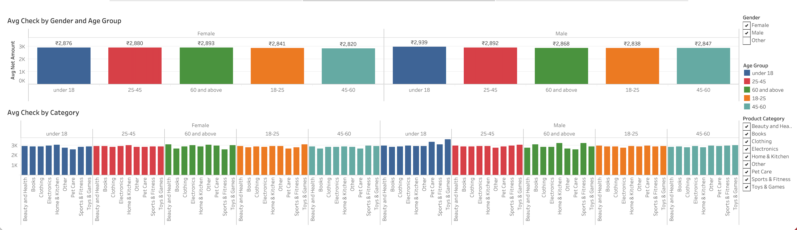

Основні спостереження:

- У більшості вікових груп середній чек у чоловіків трохи вищий.
- Найвищий середній чек серед чоловіків — у групі under 18 (₹2,939).
- У жінок найвищий середній чек — у групі 60+ (₹2,893).
- Різниця між статями незначна (у межах ~₹30–60).

Додатковий аналіз за категоріями:

При розгляді середнього чеку по категоріях суттєвої гендерної різниці також не спостерігається.
Середній чек коливається в межах ~₹2,800–3,000 незалежно від статі.

🎯 Висновок:

Аналіз показав, що чоловіки мають дещо вищий середній чек, однак різниця є мінімальною та не критичною. Це означає, що стать не є ключовим драйвером витрат. Більш важливим фактором для бізнесу є вікова група клієнтів. Тому стратегія сегментації має базуватися на поведінкових та вікових характеристиках, а не лише на статі.

3️⃣ Яка група більш схильна купляти товари за знижками?

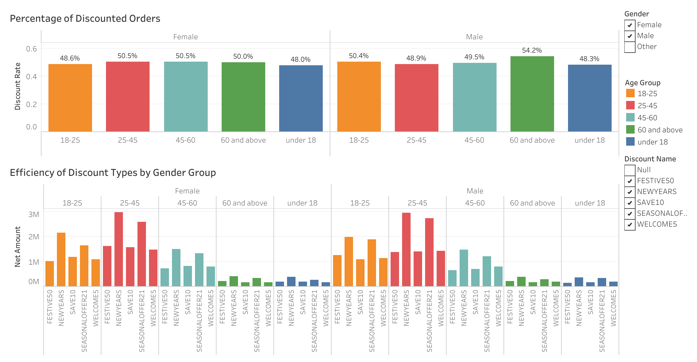

Аналіз проведено за показником Discount Rate (частка замовлень зі знижкою) = SUM(IF [Discount Availed] = "Yes" THEN 1 ELSE 0 END)
/[count_orders]

Основні спостереження:

- Загалом різниця між чоловіками та жінками мінімальна.
- Найбільш схильна до покупок зі знижками група — чоловіки 60+ (54.2%).
- У сегменті 25–45 жінки трохи частіше користуються знижками.
- В інших вікових категоріях показники майже однакові.

Додатковий аналіз по типах знижок:

- Сезонні знижки працюють краще(SEASONALOFFER21, NEWYEARS), ніж постійні невеликі промокоди.
- Невеликі welcome-знижки не генерують високий дохід, але можуть бути корисними для залучення нових клієнтів.
- Поведінка клієнтів більш залежить від їхнього сегмента (25–45), ніж від конкретного типу знижки.

🎯 Висновок:

Аналіз показав, що гендер майже не впливає на схильність до знижок. Найбільш чутливою до промоакцій є старша чоловіча аудиторія (60+). Сегмент 25–45 менш залежний від знижок, але генерує найбільший дохід. Проте різниця між сегментами невелика, що свідчить про рівномірний розподіл знижкової активності серед клієнтів.
Додатковий аналіз показав, що різні типи знижок не мають кардинального впливу на обсяг покупки. Найкращі результати демонструють сезонні кампанії, що свідчить про важливість правильно вибраного періоду, а не лише розміру або формату знижки. Тому компанії доцільно робити акцент на великих сезонних промо-акціях та використовувати welcome-знижки як інструмент залучення.

### Відповідь на головне стратегічне питання: Яку групу вважати більш "вигідною" для бізнесу в довгостроковій перспективі і чому? 

Загальний аналіз показав:
- За загальним доходом (Total Net Amount) лідирує сегмент 25–45 років (не залежно від гендеру).
- За середнім чеком різниця між статями мінімальна. Найвищі значення знову у групі 25–45 років.
- За прибутком на одного клієнта (Profit per Customer) найвищий показник також у сегменті 25–45 років.
- За залежністю від знижок сегмент 25–45 не є найбільш залежним від знижок та зберігає стабільний рівень доходу навіть без агресивних промо.

🎯 Висновок:

Найбільш вигідною для бізнесу в довгостроковій перспективі є клієнтський сегмент 25–45 років (незалежно від статі).

✔ Вона генерує найбільший загальний дохід.\
✔ Має високий середній чек.\
✔ Демонструє найвищий прибуток на одного клієнта.\
✔ Активно споживає різні категорії товарів.\
✔ Менш залежна від знижок порівняно зі старшими сегментами.\
✔ Є економічно активною та платоспроможною аудиторією.

І що важливо — гендер у цьому випадку не є визначальним фактором.
Вік має більший вплив, ніж стать.

На основі проведеного аналізу можна зробити висновок, що ключовим драйвером доходу компанії є клієнти віком 25–45 років незалежно від статі. Саме цей сегмент формує найбільшу частку виручки, має високий середній чек та демонструє стабільну поведінку без надмірної залежності від знижок. Тому стратегічний фокус компанії має бути спрямований саме на цю аудиторію.

4️⃣ Лінійна регресія: Вплив віку на суму покупки (Python) 

Мета: Перевірити, чи впливає вік клієнта на суму покупки (Gross Amount), та оцінити силу цього зв’язку за допомогою моделі лінійної регресії.

1️⃣ Exploratory Data Analysis

У процесі розвідувального аналізу даних (EDA) було проведено перевірку структури даних, пропущених значень та дублікатів. Датасет містить 55 000 унікальних записів та 13 змінних. Пропущені значення були виявлені лише у колонці Discount Name та оброблені шляхом заповнення значенням "No Discount". Дублікатів не знайдено.

Базовий статистичний аналіз показав, що дані є структурованими та придатними для подальшого аналізу. Серйозних аномалій або логічних помилок у структурі фінансових показників не виявлено.

2️⃣ Розділення на train та test вибірки.

Так як модель лінійної регресії працює лише з числовими даними, тому категоріальний вік було переведено у числове представлення.

Дані були розділені на навчальну та тестову вибірки у співвідношенні 80/20. Це дозволило перевірити, як модель працює на нових даних і оцінити її реальну прогностичну здатність.

3️⃣ Створення моделі лінійної регресії

Модель оцінює лінійну залежність між незалежною змінною (X) — вік клієнта та залежною змінною (y) — сума покупки (Gross Amount) та визначає, як зміна віку впливає на розмір витрат.

4️⃣ Інтерпритація результатів

Коефіцієнт регресії: -0.0035048550002316544

При збільшенні віку клієнта на 1 рік сума покупки зменшується приблизно на 0.0035 одиниці.
-0.0035 × 10 = -0.035
Тобто якщо клієнт "постарішає" на 10 років зміна становитиме лише 0.035 одиниці валюти. Це практично нульовий ефект.

R2: -0.00011111499557148186 (Теоретично R² має бути від 0 до 1)

R² близький до нуля (і навіть від’ємний), що свідчить про відсутність значущого зв’язку.

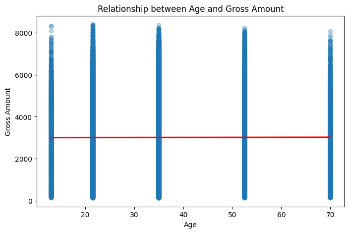

Для наочного підтвердження результатів було побудовано scatter plot із лінією регресії. Графік демонструє відсутність вираженої залежності між віком клієнта та сумою покупки. Лінія регресії майже горизонтальна, що підтверджує дуже слабкий зв’язок між змінними.

### Додатковий аналіз: вплив віку на чистий дохід (Net Amount)

Окрім аналізу Gross Amount, було додатково побудовано модель лінійної регресії для Net Amount, щоб оцінити вплив віку клієнта на фактичний дохід компанії.

Результати моделі:

Коефіцієнт регресії: -0.07017340125296537 \
R2: -0.00013282748556964208

Зміна віку на 10 років призводить до зміни Net Amount приблизно на 0.7 одиниці валюти, що є незначним показником у масштабі середнього чеку.

Низьке та від’ємне значення R² підтверджує відсутність статистично значущого зв’язку між віком і чистим доходом.
Тому це ще раз підтверджує, що вік клієнта не є фактором, що суттєво впливає на прибутковість компанії.

🎯 Bисновок:

Побудована модель показала практично нульовий зв’язок між віком та сумою покупки. Коефіцієнт регресії дуже малий, а R² від’ємний, що означає відсутність прогностичної сили. Отже, вік не є фактором, який суттєво впливає на витрати клієнтів.

Ймовірно, поведінка клієнтів та обсяг їхніх витрат формуються під впливом більшої кількості факторів, таких як категорія товару, частота покупок, історія транзакцій, регіон або індивідуальні споживчі вподобання.

📎 Jupyter Notebook: LinearRegressio.ipynb

## Загальниі висновки проекту

Проєкт демонструє повний цикл аналітики:

✔ очищення даних \
✔ дослідницький аналіз \
✔ побудову дашборду \
✔ створення та інтерпретацію ML-моделі \
✔ формулювання бізнес-висновків \

🎯 Висновок:

Бізнес характеризується стабільною сезонною структурою продажів та високою концентрацією доходу в сегменті 25–45 років. Гендерний фактор не є критичним для визначення прибутковості. Знижки не підвищують середній чек і повинні використовуватись стратегічно.
Для подальшого розвитку аналітики компанії доцільно впроваджувати більш складні моделі з урахуванням поведінкових та транзакційних характеристик клієнтів.

Можливі подальші покращення:
- Побудова багатофакторної регресії
- Сегментація клієнтів (кластеризація)
- Прогнозування LTV
- Аналіз повторних покупок